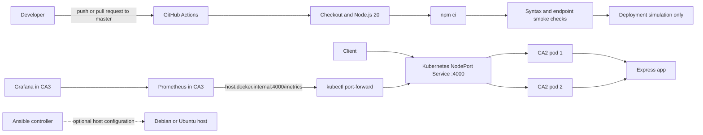
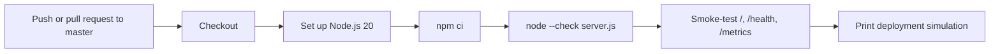

# DevOps CA2 Final Report

**Project:** DevOps CA2 Monitoring Service  
**Student:** [Insert name]  
**Student ID:** [Insert ID]  
**Course / section:** [Insert course and section]  
**Instructor:** [Insert instructor]  
**Submission date:** [Insert date]

> **Submission status:** The application and core deployment/monitoring artifacts are present. Some evidence is verified below; GitHub-hosted CI, Ansible remote deployment, and a versioned Kubernetes rollout/rollback still require execution and genuine screenshots. Do not present pending items as completed.

## 1. Executive Summary

This project packages a Node.js 20 and Express monitoring service, deploys it to Minikube as two Kubernetes replicas, and exposes application and Node.js runtime metrics to Prometheus. A GitHub Actions workflow checks the app on pushes and pull requests to `master`. An Ansible playbook is provided for configuring a Debian or Ubuntu host with a systemd service.

The live CA2 Deployment was observed with 2/2 replicas available and both pods Running. Its health endpoint returned `healthy`, and Prometheus reported the `ca2-devops` target as UP. The CI checks also passed locally. The hosted GitHub Actions run, a real Ansible host deployment, and a versioned image rollout followed by rollback have not been verified in this report.

## 2. Project Structure

```text
DevOps-CA2/
|-- .github/
|   `-- workflows/ci.yml
|-- ansible/
|   |-- deploy.yml
|   |-- inventory.ini
|   `-- README.md
|-- app/
|   |-- server.js
|   |-- package.json
|   `-- package-lock.json
|-- docker/Dockerfile
|-- docs/
|   |-- ci-cd.md
|   |-- kubernetes-rollout.md
|   |-- CA2_Final_Report.md
|   `-- CA2_Presentation.md
|-- kubernetes/
|   |-- deployment.yaml
|   `-- service.yaml
|-- monitoring/
|   |-- ca2-dashboard.json
|   `-- README.md
`-- .gitignore
```

The application dependencies and lockfile are under `app/`. The root `package-lock.json` is empty and has no corresponding root `package.json`; `.gitignore` excludes that orphan file as well as `node_modules` and local secret files. Prometheus' active scrape configuration is maintained in the separate CA3 project because the existing Prometheus container mounts that CA3 file.

## 3. Architecture

The app serves the homepage, health response, and metrics from port 4000. Kubernetes routes traffic to two app replicas. Prometheus scrapes the app through the host port-forward; Grafana queries Prometheus. The CI pipeline checks the app independently and simulates, but does not perform, deployment.



**Figure placeholder:** Insert an exported architecture diagram or a screenshot of the final architecture view here: `[Insert real architecture diagram or screenshot]`.

## 4. Task 1: GitHub Actions CI/CD

The workflow is `.github/workflows/ci.yml`. It runs on `push` and `pull_request` events targeting `master`. Its job checks out the repository, configures Node.js 20, installs the app lockfile with `npm ci`, checks `server.js` syntax, starts the Express service, smoke-tests `/`, `/health`, and `/metrics`, and prints a deployment simulation message. It does **not** deploy to Minikube or another environment.

The app's `npm test` script is currently a placeholder that exits with an error, so the workflow uses syntax and endpoint checks instead of `npm test`.

**Local verification observed:** `npm ci --dry-run` succeeded; `node --check server.js` passed; a local runtime smoke test passed for the homepage, a healthy timestamp response, the HTTP request counter and duration histogram, and Node.js metrics. These are local checks, not evidence of a GitHub-hosted Actions run.

**Documentation discrepancy:** the existing `docs/ci-cd.md` still says the workflow targets `main`; the workflow currently targets `master`. Update that older guide before submission or clearly use this report and the actual workflow as the source of truth.



**Figure placeholder:** Insert a screenshot of a successful GitHub Actions run on `master`: `[Insert real Actions run screenshot]`.

## 5. Task 2: Ansible Configuration Management

The `ansible/` directory contains `deploy.yml`, `inventory.ini`, and `README.md`. The playbook targets Debian/Ubuntu hosts, installs `nodejs` and `npm` from the host's configured apt repositories, creates a restricted `devops-ca2` service account and `/opt/devops-ca2`, copies `server.js` plus the npm manifests, installs production dependencies with `npm ci --omit=dev`, and enables a systemd service on port 4000 with restart-on-failure behavior.

The inventory address `192.0.2.10` is reserved for documentation and is not a real host. Replace it and the SSH user before running any Ansible command. The playbook installs the distribution-provided Node.js version; unlike the Dockerfile, it does not pin Node.js 20.

**Status: pending verification.** No real target was configured, no remote deployment was performed, and no successful Ansible result is claimed. Ansible syntax validation was unavailable in the checked environment. The documented checks are:

```bash
ansible -i ansible/inventory.ini ca2_app -m ping
ansible-playbook --syntax-check -i ansible/inventory.ini ansible/deploy.yml
```

After configuring a real Debian/Ubuntu host with SSH, Python 3, sudo, systemd, and apt access, the deployment command is:

```bash
ansible-playbook -i ansible/inventory.ini ansible/deploy.yml
```

**Evidence placeholder:** Insert actual syntax-check output, target connectivity, systemd service status, and `/health` response after a real deployment: `[Insert genuine Ansible evidence]`.

## 6. Task 3: Docker and Kubernetes

### Container image

`docker/Dockerfile` uses `node:20-alpine`, sets `/app` as the working directory, installs production dependencies with `npm ci --omit=dev`, exposes port 4000, and runs as the non-root `node` user. The project record reports that the image was built successfully; no build log or screenshot is stored in this documentation set.

Build and load a versioned image into Minikube with:

```powershell
docker build -f docker/Dockerfile -t devops-ca2:v2 .
minikube image load devops-ca2:v2
```

### Kubernetes deployment

`kubernetes/deployment.yaml` declares two replicas, port 4000, `/health` readiness and liveness probes, and `imagePullPolicy: Never` for Minikube-local images. `kubernetes/service.yaml` exposes the pods through a NodePort Service. The current Deployment image is `docker.io/library/devops-ca2:latest`.

**Current read-only verification (2026-10-03):** `kubectl get deployment` reported `READY 2/2`, `UP-TO-DATE 2`, and `AVAILABLE 2`; both CA2 pods were Running with zero restarts. `kubectl rollout status deployment/devops-ca2 --timeout=10s` reported `deployment "devops-ca2" successfully rolled out`. The Service reported `4000:31013/TCP`. Rollout history showed revisions 1–4 with no change-cause metadata.

### Rolling update and rollback

The manifest does not set `spec.strategy`; Kubernetes therefore applies its default `RollingUpdate`. The live Deployment reported `maxSurge: 25%` and `maxUnavailable: 25%`. The actual versioned update and undo have **not** been run; the revisions currently listed are not proof of this assignment's rollout/rollback exercise.

After building and loading a new image, a manual update can be performed with:

```powershell
kubectl set image deployment/devops-ca2 devops-ca2=docker.io/library/devops-ca2:v2
kubectl rollout status deployment/devops-ca2 --timeout=120s
kubectl rollout history deployment/devops-ca2
```

To roll back to the previous revision:

```powershell
kubectl rollout undo deployment/devops-ca2
kubectl rollout status deployment/devops-ca2 --timeout=120s
kubectl rollout history deployment/devops-ca2
```

`kubectl set image` changes the live Deployment, not the manifest. Keep the desired image version synchronized in source control as appropriate. Full instructions are in `docs/kubernetes-rollout.md`.

**Status: pending execution and evidence.** Capture the image tag before/after, rollout progress, rollout history, rollback result, pods ready after rollback, and successful `/health` response. No screenshots or rollout outcomes are claimed here.

**Evidence placeholder:** `[Insert genuine rollout, rollback, pod status, and post-rollback health screenshots]`.

## 7. Task 4: Prometheus and Grafana Monitoring

The Express service exposes `/metrics` using `prom-client`. It includes `http_requests_total`, `http_request_duration_seconds`, and default Node.js/process metrics. The dashboard definition in `monitoring/ca2-dashboard.json` includes application scrape health, request totals, request rate by route, Node.js heap usage, and process resident memory.

Prometheus is running in the CA3 environment. Its active configuration is external to this repository at `D:\Study Materials 7th sem\DevOps Lab\CA3-DevOps\monitoring\prometheus.yml`. The CA2 job targets `host.docker.internal:4000/metrics`; Prometheus reaches CA2 through a port-forward that must remain running:

```powershell
kubectl port-forward service/devops-ca2 4000:4000
```

**Current read-only verification (2026-10-03):** Prometheus' targets API reported `ca2-devops` UP at `http://host.docker.internal:4000/metrics`, and query `up{job="ca2-devops"}` returned `1`. The CA2 health endpoint returned `status=healthy` with a current timestamp.

The existing `ca3-devops` target was preserved, but the current targets API reports it DOWN: `host.docker.internal:3000/metrics` returns `connection refused`. This is the status of that separate existing target, not the CA2 target.

The project owner previously reported importing the Grafana dashboard and seeing CA2 metrics. The JSON dashboard is present, but no Grafana screenshot is stored here; the dashboard display is not independently evidenced in this report. Add screenshots of the Grafana dashboard and Prometheus target page before submission.

**Evidence placeholders:**

- Prometheus targets showing `ca2-devops` UP: `[Insert real Prometheus targets screenshot]`
- Grafana CA2 dashboard showing populated panels: `[Insert real Grafana dashboard screenshot]`
- Metrics endpoint output: `[Insert real /metrics or Prometheus query screenshot]`

## 8. Task 5: Reflection, Challenges, and Lessons

This project connects application packaging, automation, orchestration, and observability around one small Express service. The local CI checks validate useful behaviors without requiring a remote deployment environment. Docker provides a reproducible Node.js 20 image, Kubernetes runs multiple replicas and checks health, and Prometheus exposes operational measurements for Grafana.

### Challenges encountered

- **Branch alignment:** the workflow needed to target `master`; `docs/ci-cd.md` still references `main` and should be reconciled.
- **Local image distribution:** Minikube must have the exact image tag loaded because the Deployment uses `imagePullPolicy: Never`.
- **Metrics network path:** the CA3 Prometheus container reaches the CA2 service through `host.docker.internal:4000`; the Kubernetes port-forward must remain active.
- **Evidence versus implementation:** a declared CI workflow, Ansible playbook, or rollback command is not evidence that it ran successfully. Hosted CI, remote Ansible, and versioned rollout/rollback evidence remain pending.
- **Runtime version consistency:** Docker pins Node.js 20, while Ansible uses the target distribution's `nodejs` package. Pin and verify the desired runtime version on the Ansible target if parity is required.

### Lessons learned

- Keep application, Docker, Kubernetes, and Ansible configuration explicit and make environment-specific assumptions visible.
- Use immutable image tags for deployment history and rollback; avoid relying only on `latest` for the demonstrated update.
- Validate health and metrics end-to-end through the same path used by the monitoring system.
- Preserve unrelated infrastructure and clearly distinguish verified results from planned work and screenshots still to be collected.

**Reflection personalization:** Add your own account of the work you performed, problems you personally encountered, and what you would improve next: `[Add student-specific reflection]`.

## 9. Verification and Evidence Register

| Item | Status | Evidence / follow-up |
|---|---|---|
| App JavaScript syntax | Verified locally with `node --check server.js` | Add CI run screenshot if available |
| App smoke tests | Verified locally for `/`, `/health`, `/metrics`, request and Node.js metrics | Capture real command output |
| GitHub Actions hosted run | Pending | Push/open a PR to `master`; attach successful run screenshot |
| Docker image build | Reported as successful by project owner; build artifact/log not included here | Capture build output and image tag |
| Kubernetes availability | Verified: 2/2 ready, pods Running, zero restarts | Capture `kubectl get` output |
| Kubernetes rollout status/history | Read-only current check succeeded; revisions 1–4 exist | Not evidence of the required new-image rollout |
| Versioned rolling update | Pending | Execute approved tagged-image rollout and capture output |
| Kubernetes rollback | Pending | Execute rollback, verify readiness/health, capture output |
| Ansible syntax/deployment | Pending; no real host configured or deployed | Replace sample inventory, run syntax/connectivity checks and deployment |
| Prometheus CA2 target | Verified UP; `up{job="ca2-devops"}=1` | Capture targets/query screenshot |
| Existing CA3 Prometheus target | Currently DOWN at port 3000 with connection refused | Reported without altering its configuration |
| Grafana dashboard | JSON definition present; import/display reported by project owner | Attach real screenshot of populated dashboard |
| Architecture / pipeline diagrams | Mermaid diagrams included in this report | Export or capture them if the submission requires image files |

## 10. Submission Evidence To Collect

1. A successful GitHub Actions run on `master` showing all workflow steps passed.
2. Ansible syntax-check and connectivity output, plus a real target deployment, active systemd service, and successful `/health` response.
3. Docker build output showing the image tag used.
4. Kubernetes evidence before and after a new tagged image rollout: rollout status, pod readiness, and revision history.
5. Kubernetes rollback output and a successful health check after rollback.
6. Prometheus targets page showing `ca2-devops` UP and a query or metrics sample.
7. Grafana dashboard screenshot with populated CA2 panels.
8. Final architecture/pipeline diagram images if required separately by the instructor.

Store only genuine screenshots from your own environment. No screenshot files are included or represented as captured in this report.